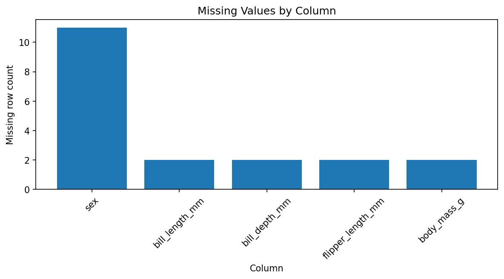
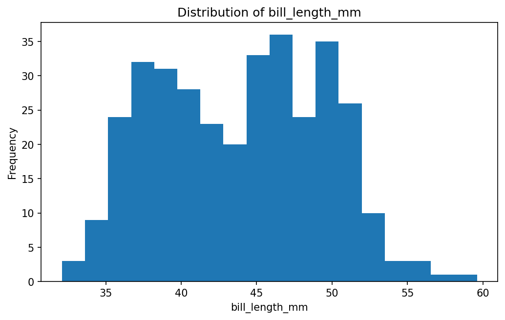
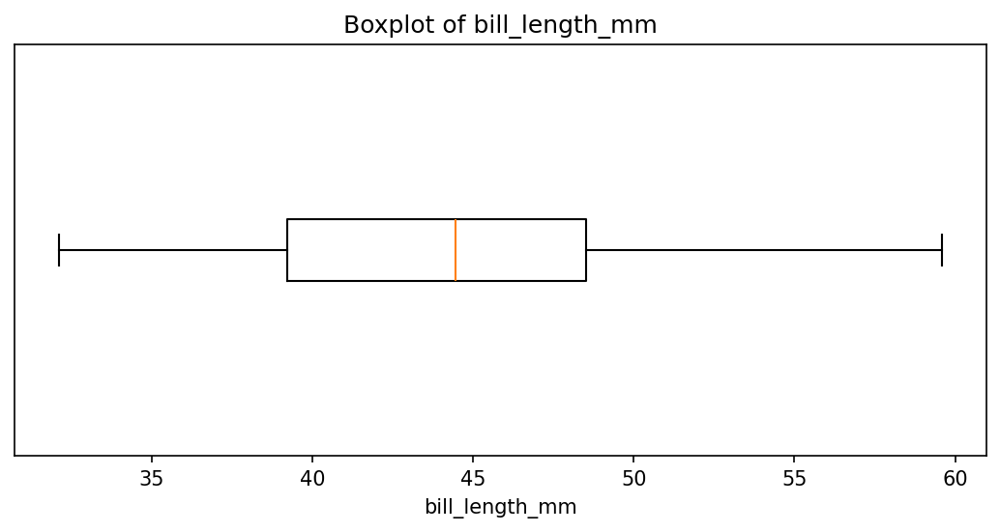
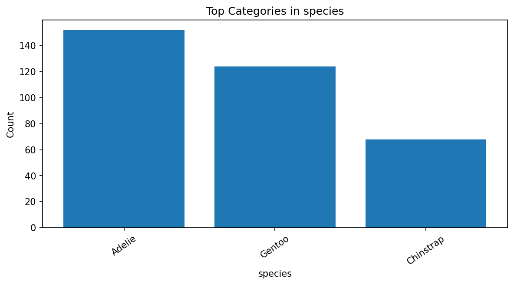
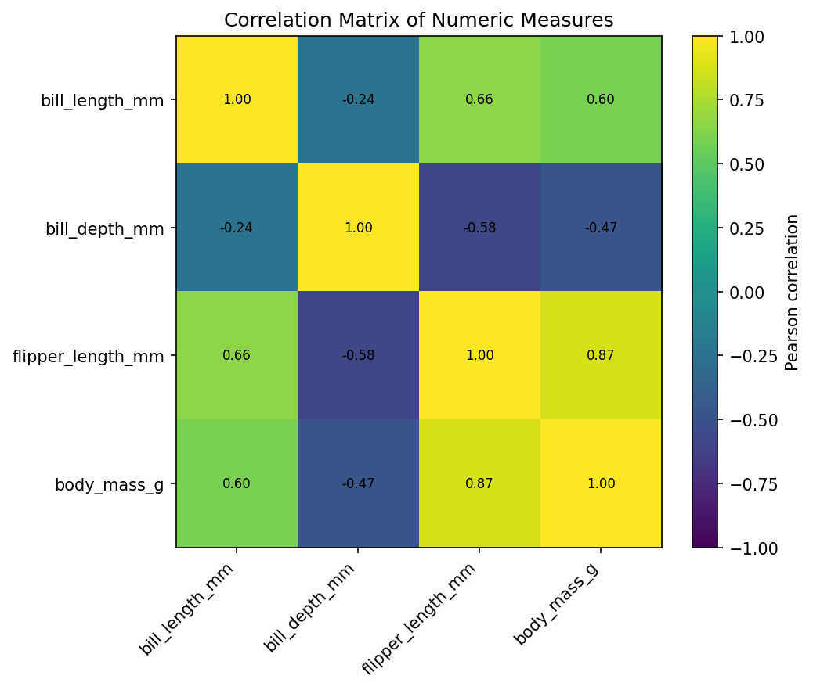
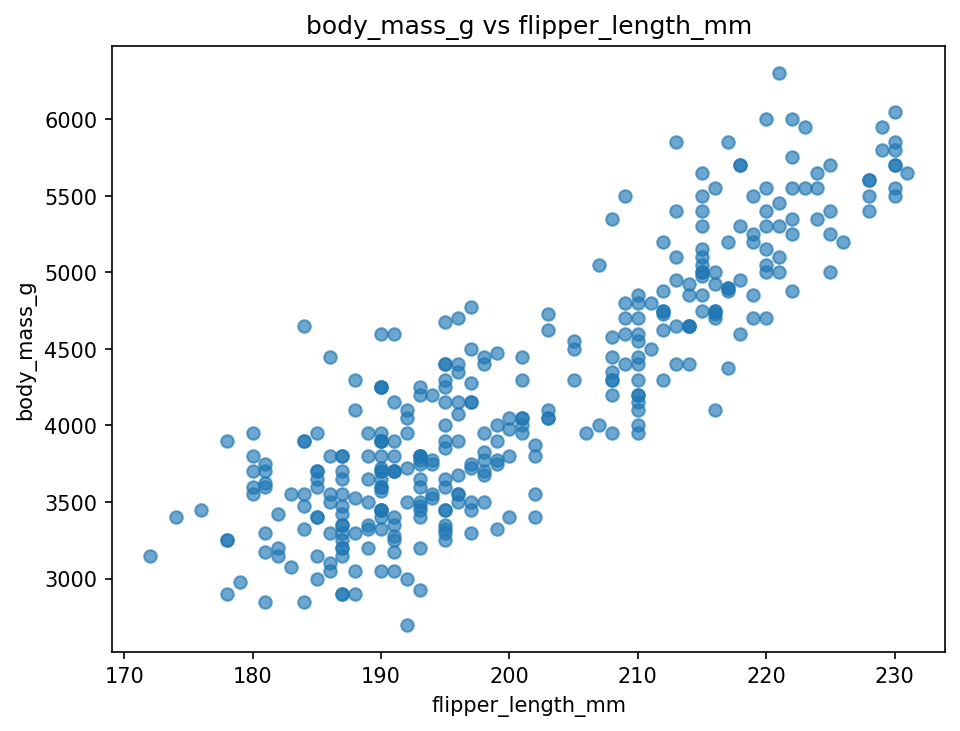
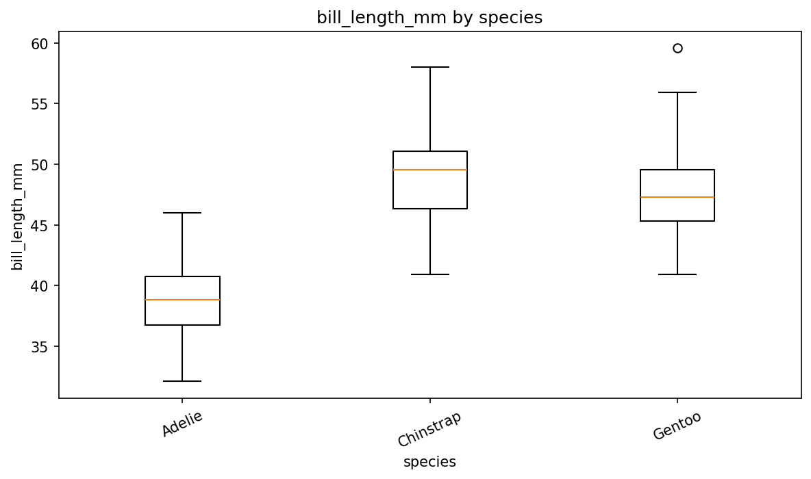
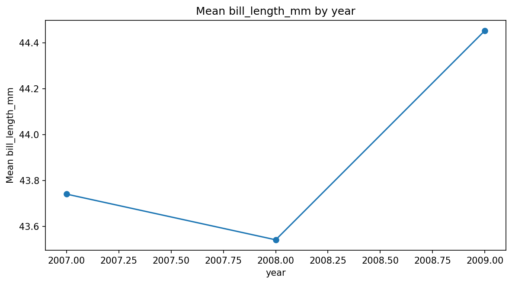

# Automated CSV Profile: dataset_a_penguins.csv

## 1. Dataset Overview

- **Filename:** `dataset_a_penguins.csv`
- **Rows:** 344
- **Columns:** 8
- **Column names:** `species`, `island`, `bill_length_mm`, `bill_depth_mm`, `flipper_length_mm`, `body_mass_g`, `sex`, `year`

| Column | Pandas dtype | Inferred technical type | Probable role | Non-missing | Missing % | Unique |
| --- | --- | --- | --- | --- | --- | --- |
| species | object | text | Categorical attribute | 344 | 0.0% | 3 |
| island | object | text | Categorical attribute | 344 | 0.0% | 3 |
| bill_length_mm | float64 | numeric | Numeric measure | 342 | 0.6% | 164 |
| bill_depth_mm | float64 | numeric | Numeric measure | 342 | 0.6% | 80 |
| flipper_length_mm | float64 | numeric | Numeric measure | 342 | 0.6% | 55 |
| body_mass_g | float64 | numeric | Numeric measure | 342 | 0.6% | 94 |
| sex | object | text | Categorical attribute | 333 | 3.2% | 2 |
| year | int64 | integer | Date-like field | 344 | 0.0% | 3 |

## 2. Data Quality Profile

- **Duplicate rows:** 0 (0.0%)
- **Constant columns:** None detected
- **High-missingness threshold:** 30%
- **Columns at/above the threshold:** None
- **Mixed/inconsistent type columns:** None detected
- **Identifier-like/high-cardinality fields:** None detected
- **Potentially sensitive fields (heuristic):** `sex` (column-name heuristic)
- **Important:** Sensitive-field detection is heuristic. No warning does not prove that a dataset is safe, and a warning can be a false positive without semantic context.
- The program **does not automatically delete** rows, missing values, or outliers; it profiles and flags them.

## 3. Descriptive Statistics

### Numeric columns

| Column | Valid | Missing % | Min | Max | Mean | Median | Mode | Std dev | Q1 | Q3 | IQR | 1.5×IQR outliers |
| --- | --- | --- | --- | --- | --- | --- | --- | --- | --- | --- | --- | --- |
| bill_length_mm | 342 | 0.6% | 32.1 | 59.6 | 43.922 | 44.45 | 41.1 | 5.46 | 39.225 | 48.5 | 9.275 | 0 (0.0%) |
| bill_depth_mm | 342 | 0.6% | 13.1 | 21.5 | 17.151 | 17.3 | 17 | 1.975 | 15.6 | 18.7 | 3.1 | 0 (0.0%) |
| flipper_length_mm | 342 | 0.6% | 172 | 231 | 200.915 | 197 | 190 | 14.062 | 190 | 213 | 23 | 0 (0.0%) |
| body_mass_g | 342 | 0.6% | 2,700.00 | 6,300.00 | 4,201.75 | 4,050.00 | 3,800.00 | 801.955 | 3,550.00 | 4,750.00 | 1,200.00 | 0 (0.0%) |

### Categorical columns

#### `species`
- Unique categories: 3
- Most frequent value(s): `Adelie`
| Value | Count | % of all rows |
| --- | --- | --- |
| Adelie | 152 | 44.2% |
| Gentoo | 124 | 36.0% |
| Chinstrap | 68 | 19.8% |

#### `island`
- Unique categories: 3
- Most frequent value(s): `Biscoe`
| Value | Count | % of all rows |
| --- | --- | --- |
| Biscoe | 168 | 48.8% |
| Dream | 124 | 36.0% |
| Torgersen | 52 | 15.1% |

#### `sex`
- Unique categories: 2
- Most frequent value(s): `male`
| Value | Count | % of all rows |
| --- | --- | --- |
| male | 168 | 48.8% |
| female | 165 | 48.0% |

## 4. Relationships Between Variables

- Strongest positive correlation: `flipper_length_mm` vs `body_mass_g` = **0.871**
- Strongest negative correlation: `bill_depth_mm` vs `flipper_length_mm` = **-0.584**
- **Interpretation caution:** Pearson correlation measures linear association and must not be interpreted as causation.

## 5. Adaptive Visualizations

### Missing Values by Column
**Why this plot is appropriate:** Shows where incomplete observations are concentrated.

### Distribution of bill_length_mm
**Why this plot is appropriate:** A histogram is appropriate for showing the shape and spread of a numeric measure.

### Boxplot of bill_length_mm
**Why this plot is appropriate:** A boxplot summarizes median, quartiles, and potential 1.5×IQR outliers.

### Top Categories in species
**Why this plot is appropriate:** A bar chart directly compares frequencies for a categorical attribute.

### Correlation Matrix of Numeric Measures
**Why this plot is appropriate:** A heatmap summarizes pairwise linear relationships among suitable numeric measures; correlation is not causation.

### body_mass_g vs flipper_length_mm
**Why this plot is appropriate:** This pair has the largest absolute Pearson correlation among eligible numeric measures (r=0.871).

### bill_length_mm by species
**Why this plot is appropriate:** Grouped boxplots compare a numeric distribution across a small number of categories.

### Mean bill_length_mm by year
**Why this plot is appropriate:** A line plot is appropriate for showing how an aggregated numeric measure changes across an ordered date/year field.

## 6. Verified Evidence-Based Insights

The following statements are generated deterministically from Python-calculated results, not calculated by the language model.

1. Data quality: the largest missingness occurs in `sex` with 11 missing rows (3.2%); no column reaches the 30% high-missingness threshold.
2. Distribution: `bill_length_mm` has median 44.45, Q1 39.225, Q3 48.5, and ranges from 32.1 to 59.6. The 1.5×IQR rule flags 0 values (0.0% of valid observations) as potential outliers.
3. Categorical pattern: `species` has 3 observed categories; `Adelie` is the most frequent with 152 rows (44.2% of all rows).
4. Relationship: `flipper_length_mm` and `body_mass_g` have the largest absolute Pearson correlation among eligible numeric measures (r=0.871). This describes linear association only and does not establish causation.
5. Limitation: this automated profile describes the 344 rows and 8 columns present in `dataset_a_penguins.csv` only. Without an external schema or data dictionary, field meaning, units, valid ranges, sampling design, and representativeness cannot be verified from the CSV alone.
6. Further investigation: examine whether the association between `flipper_length_mm` and `body_mass_g` remains similar within major categories rather than relying only on the overall correlation.
7. Additional quality finding: no duplicate rows or constant columns were detected by the automated checks.

## 7. AI-Assisted Narrative

- **LLM provider:** `manual`
- **Model/configuration:** `ChatGPT GPT-5.6 Sol`
- **Status:** `ok`

- Data quality: `sex` has the most missing values with 11 missing rows (3.2%), while no column reaches the configured 30% high-missingness threshold.
- Distribution: `bill_length_mm` has a median of 44.45, with Q1 = 39.225 and Q3 = 48.5, and the 1.5×IQR rule flags 0 potential outliers.
- Categorical pattern: `species` contains 3 observed categories, and `Adelie` is the most frequent with 152 rows (44.2% of all rows).
- Relationship: `flipper_length_mm` and `body_mass_g` have the largest absolute Pearson correlation among eligible numeric measures, r = 0.871; this is an association and does not establish causation.
- Data-quality caution: the `sex` column is flagged by the sensitive-field name heuristic, but that heuristic alone cannot determine whether a field is actually sensitive in context.
- Limitation: the profile describes only the rows and columns present in the CSV; without an external schema or data dictionary, meanings, units, valid ranges, sampling design, and representativeness cannot be verified.
- Follow-up question: does the relationship between `flipper_length_mm` and `body_mass_g` remain similar within the major categorical groups in the dataset?

The LLM received a structured summary produced by Python. The prompt explicitly forbids inventing statistics, meanings, units, causes, or causal claims. The deterministic insights above remain the traceable source of quantitative evidence.

## 8. Automated-Analysis Limitations

- Type and role inference is heuristic and can be wrong without a schema or data dictionary.
- Missing-value detection recognizes values pandas parses as missing; undocumented sentinel codes may be missed.
- The 1.5×IQR rule flags potential outliers but does not determine whether they are errors.
- Sensitive-field detection can produce false positives or false negatives because it uses names and simple value patterns.
- Correlation captures linear association only and does not establish causation.
- This report does not establish data representativeness, fairness, or suitability for a downstream model.

---

Generated automatically by `src/profiler.py`.
