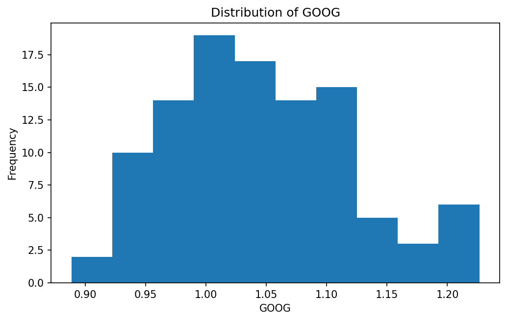
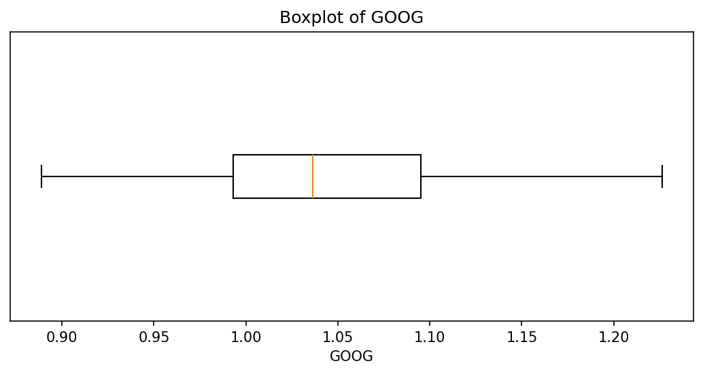
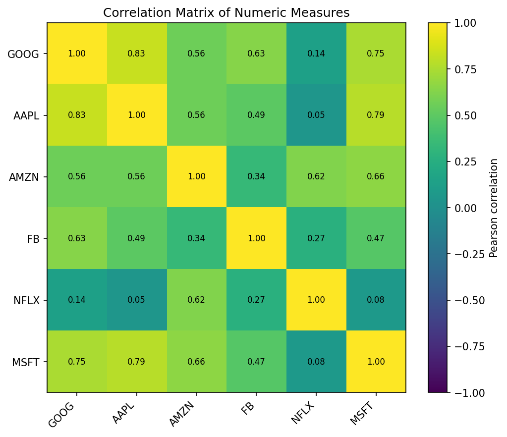
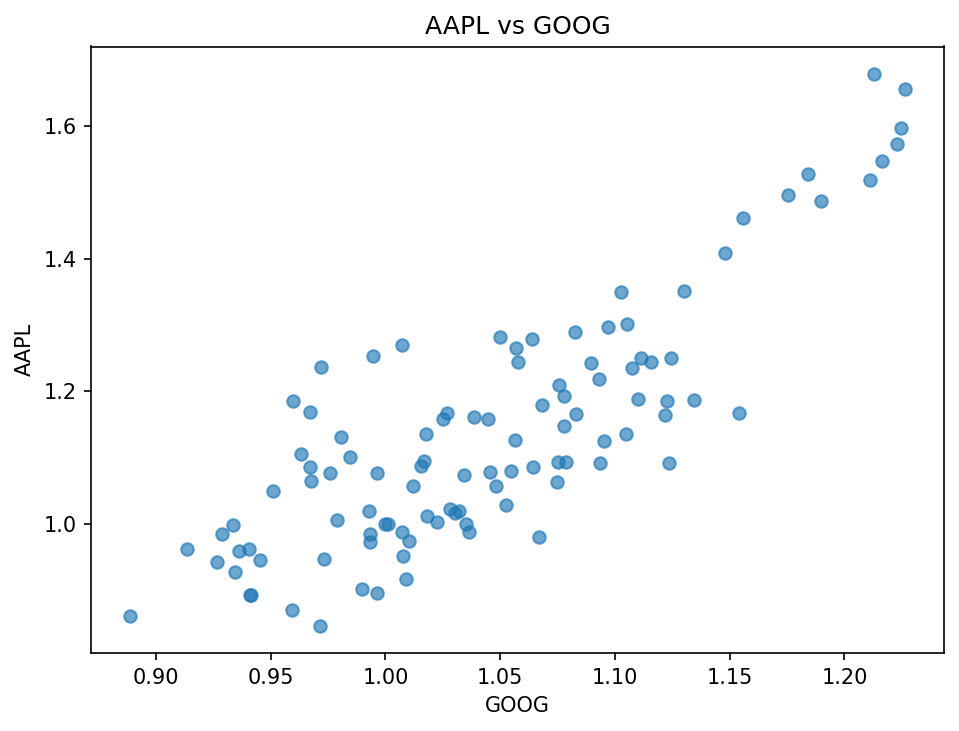
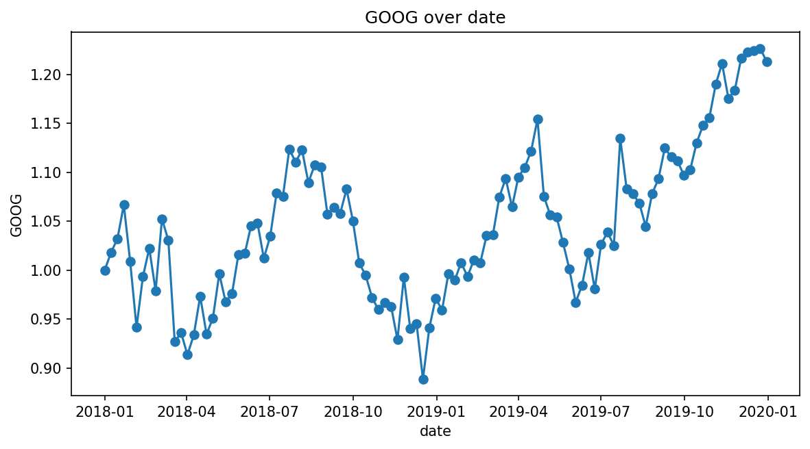

# Automated CSV Profile: dataset_b_stocks.csv

## 1. Dataset Overview

- **Filename:** `dataset_b_stocks.csv`
- **Rows:** 105
- **Columns:** 7
- **Column names:** `date`, `GOOG`, `AAPL`, `AMZN`, `FB`, `NFLX`, `MSFT`

| Column | Pandas dtype | Inferred technical type | Probable role | Non-missing | Missing % | Unique |
| --- | --- | --- | --- | --- | --- | --- |
| date | object | date-like text | Date-like field | 105 | 0.0% | 105 |
| GOOG | float64 | numeric | Numeric measure | 105 | 0.0% | 104 |
| AAPL | float64 | numeric | Numeric measure | 105 | 0.0% | 105 |
| AMZN | float64 | numeric | Numeric measure | 105 | 0.0% | 105 |
| FB | float64 | numeric | Numeric measure | 105 | 0.0% | 105 |
| NFLX | float64 | numeric | Numeric measure | 105 | 0.0% | 105 |
| MSFT | float64 | numeric | Numeric measure | 105 | 0.0% | 103 |

## 2. Data Quality Profile

- **Duplicate rows:** 0 (0.0%)
- **Constant columns:** None detected
- **High-missingness threshold:** 30%
- **Columns at/above the threshold:** None
- **Mixed/inconsistent type columns:** None detected
- **Identifier-like/high-cardinality fields:** None detected
- **Potentially sensitive fields (heuristic):** None flagged
- **Important:** Sensitive-field detection is heuristic. No warning does not prove that a dataset is safe, and a warning can be a false positive without semantic context.
- The program **does not automatically delete** rows, missing values, or outliers; it profiles and flags them.

## 3. Descriptive Statistics

### Numeric columns

| Column | Valid | Missing % | Min | Max | Mean | Median | Mode | Std dev | Q1 | Q3 | IQR | 1.5×IQR outliers |
| --- | --- | --- | --- | --- | --- | --- | --- | --- | --- | --- | --- | --- |
| GOOG | 105 | 0.0% | 0.889 | 1.227 | 1.046 | 1.036 | N/A | 0.078 | 0.993 | 1.095 | 0.102 | 0 (0.0%) |
| AAPL | 105 | 0.0% | 0.847 | 1.678 | 1.139 | 1.095 | N/A | 0.182 | 1 | 1.236 | 0.236 | 3 (2.9%) |
| AMZN | 105 | 0.0% | 1 | 1.637 | 1.394 | 1.42 | N/A | 0.141 | 1.304 | 1.492 | 0.188 | 1 (1.0%) |
| FB | 105 | 0.0% | 0.669 | 1.124 | 0.945 | 0.96 | N/A | 0.103 | 0.88 | 1.017 | 0.137 | 1 (1.0%) |
| NFLX | 105 | 0.0% | 1 | 1.958 | 1.541 | 1.561 | N/A | 0.201 | 1.399 | 1.702 | 0.303 | 0 (0.0%) |
| MSFT | 105 | 0.0% | 0.989 | 1.802 | 1.318 | 1.242 | N/A | 0.221 | 1.143 | 1.544 | 0.401 | 0 (0.0%) |

### Categorical columns

No categorical/Boolean columns were inferred, so categorical frequency analysis was skipped.

## 4. Relationships Between Variables

- Strongest positive correlation: `GOOG` vs `AAPL` = **0.834**
- No negative off-diagonal correlation was present among eligible numeric measures.
- **Interpretation caution:** Pearson correlation measures linear association and must not be interpreted as causation.

## 5. Adaptive Visualizations

### Distribution of GOOG
**Why this plot is appropriate:** A histogram is appropriate for showing the shape and spread of a numeric measure.

### Boxplot of GOOG
**Why this plot is appropriate:** A boxplot summarizes median, quartiles, and potential 1.5×IQR outliers.

### Correlation Matrix of Numeric Measures
**Why this plot is appropriate:** A heatmap summarizes pairwise linear relationships among suitable numeric measures; correlation is not causation.

### AAPL vs GOOG
**Why this plot is appropriate:** This pair has the largest absolute Pearson correlation among eligible numeric measures (r=0.834).

### GOOG over date
**Why this plot is appropriate:** A line plot is appropriate for showing a numeric measure across an ordered date field.

### Skipped plot types
- Missing-value bar chart skipped because no columns contain missing values.
- Categorical frequency chart skipped because no categorical or Boolean field was available.
- Numeric-by-category plot skipped because no categorical field with 2–8 levels was available.

## 6. Verified Evidence-Based Insights

The following statements are generated deterministically from Python-calculated results, not calculated by the language model.

1. Data quality: all 105 rows are complete across the 7 columns with respect to pandas-recognized missing values; this does not rule out undocumented sentinel codes.
2. Distribution: `GOOG` has median 1.036, Q1 0.993, Q3 1.095, and ranges from 0.889 to 1.227. The 1.5×IQR rule flags 0 values (0.0% of valid observations) as potential outliers.
3. Categorical pattern: no categorical or Boolean field was inferred, so category-frequency analysis was skipped.
4. Relationship: `GOOG` and `AAPL` have the largest absolute Pearson correlation among eligible numeric measures (r=0.834). This describes linear association only and does not establish causation.
5. Limitation: this automated profile describes the 105 rows and 7 columns present in `dataset_b_stocks.csv` only. Without an external schema or data dictionary, field meaning, units, valid ranges, sampling design, and representativeness cannot be verified from the CSV alone.
6. Further investigation: examine whether the association between `GOOG` and `AAPL` is stable across ordered portions of the dataset, such as different time windows when an ordered date field is available.
7. Additional quality finding: no duplicate rows or constant columns were detected by the automated checks.

## 7. AI-Assisted Narrative

- **LLM provider:** `manual`
- **Model/configuration:** `ChatGPT GPT-5.6 Sol`
- **Status:** `ok`

- Data quality: all 105 rows are complete across the 7 columns with respect to pandas-recognized missing values, although undocumented sentinel values could still exist.
- Distribution: `GOOG` has a median of 1.036, Q1 = 0.993, Q3 = 1.095, and ranges from 0.889 to 1.227; the 1.5×IQR rule flags 0 potential outliers.
- Categorical analysis was skipped because no categorical or Boolean field was inferred in this dataset.
- Relationship: `GOOG` and `AAPL` have the largest absolute Pearson correlation among eligible numeric measures, r = 0.834; this does not establish causation.
- Data quality: no duplicate rows or constant columns were detected by the automated checks.
- Limitation: without an external schema or data dictionary, the profiler cannot verify field meanings, units, valid ranges, sampling design, or representativeness from the CSV alone.
- Follow-up question: is the association between `GOOG` and `AAPL` stable across different ordered portions of the dataset, such as different time windows represented by the date field?

The LLM received a structured summary produced by Python. The prompt explicitly forbids inventing statistics, meanings, units, causes, or causal claims. The deterministic insights above remain the traceable source of quantitative evidence.

## 8. Automated-Analysis Limitations

- Type and role inference is heuristic and can be wrong without a schema or data dictionary.
- Missing-value detection recognizes values pandas parses as missing; undocumented sentinel codes may be missed.
- The 1.5×IQR rule flags potential outliers but does not determine whether they are errors.
- Sensitive-field detection can produce false positives or false negatives because it uses names and simple value patterns.
- Correlation captures linear association only and does not establish causation.
- This report does not establish data representativeness, fairness, or suitability for a downstream model.

---

Generated automatically by `src/profiler.py`.
